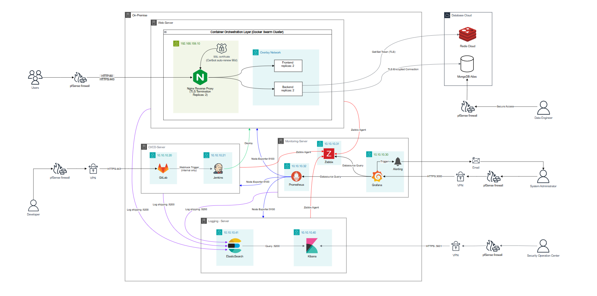
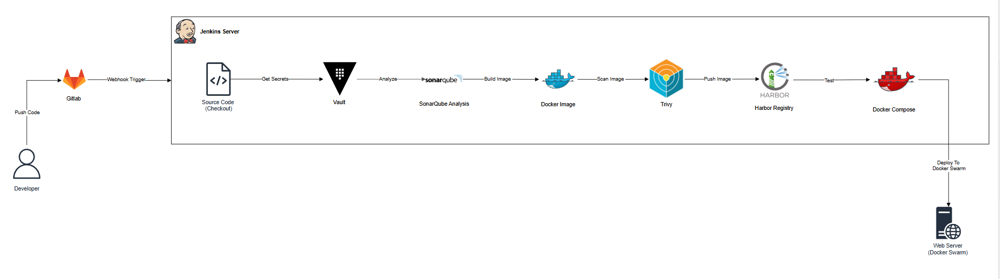
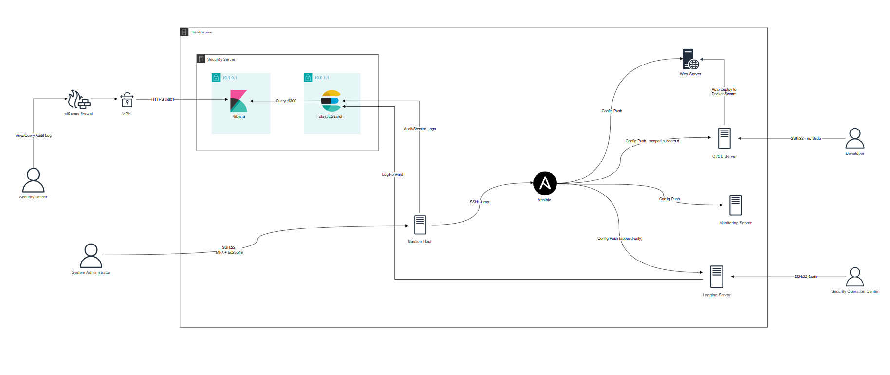

# Shoe App — Kiến Trúc Hệ Thống & Hướng Dẫn Hạ Tầng

> **Đối tượng đọc**: Sinh viên mới học DevOps / System Admin.
> **Mục tiêu tài liệu này**: Cho bạn cái nhìn *toàn cảnh* trước khi đi vào từng server. Đọc xong file này, bạn hiểu hệ thống có những máy nào, chúng nói chuyện với nhau ra sao, và nên setup theo thứ tự nào.
> **Nguồn sự thật**: 3 sơ đồ kiến trúc (On-Premise tổng quan, CI/CD Pipeline, Security/Access Control). Mọi IP và port dưới đây khớp chính xác với 3 sơ đồ đó.

---

## 1. Hệ Thống Này Làm Gì?

Đây là hạ tầng để chạy **ứng dụng web Shoe** (cửa hàng giày: Frontend + Backend) một cách **an toàn, tự động và có giám sát**, theo mô hình một công ty thật:

- **Người dùng** truy cập web qua internet → đi qua tường lửa → tới ứng dụng chạy bằng Docker Swarm.
- **Lập trình viên** push code → hệ thống **tự động** build, quét bảo mật, rồi deploy (CI/CD).
- Mọi máy đều được **giám sát** (CPU/RAM/service) và **ghi log** tập trung.
- Mọi truy cập quản trị đều đi qua **một cổng duy nhất** (Bastion) và được **ghi âm lại** để kiểm toán.

Hệ thống chia làm 3 vùng:

| Vùng | Gồm gì | Ai quản |
|------|--------|---------|
| **On-Premise** (tự host) | Web, CI/CD, Monitoring, Logging, Security, Bastion/Ansible | Đội vận hành |
| **Database Cloud** | MongoDB Atlas, Redis Cloud | Nhà cung cấp cloud |
| **Người dùng & Quản trị** | User, Developer, SysAdmin, SOC, Security Officer, Data Engineer | Truy cập qua pfSense/VPN |

---

## 2. Sơ Đồ Tổng Quan (Sơ Đồ 1 — On-Premise)



<details>
<summary>Xem sơ đồ dạng text (nếu ảnh chưa hiển thị)</summary>

```
                 INTERNET
                    │
        ┌───────────┼────────────────────────────┐
        │           │                            │
   HTTP/HTTPS    VPN + pfSense Firewall      Secure Access
   (User)        (Dev, SysAdmin, SOC, SecOfficer)   (Data Engineer)
        │           │                            │
        ▼           ▼                            ▼
┌─────────────────────────── ON-PREMISE ───────────────────────────┐
│                                                                   │
│  WEB SERVER (192.168.159.10 / 10.10.10.10)                        │
│   Nginx Reverse Proxy + TLS  ──▶ Frontend ×2                      │
│   (Docker Swarm, Replicas)   ──▶ Backend  ×2 ──┐                  │
│                                                 │                  │
│  CI/CD SERVER          MONITORING SERVER        │  LOGGING SERVER  │
│   GitLab    10.10.10.20  Grafana   10.10.10.30  │   Kibana 10.10.10.40 │
│   Jenkins   10.10.10.21  Zabbix    10.10.10.31  │   Elastic 10.10.10.41│
│                          Prometheus 10.10.10.32 │                  │
│                                                 │                  │
│  SECURITY SERVER (SIEM)        BASTION + ANSIBLE                   │
│   Elastic 10.0.1.1             Bastion 10.10.10.5                  │
│   Kibana  10.1.0.1             (SSH jump → Ansible config push)    │
└───────────────────────────────────────────┼──────────────────────┘
                                             │ TLS
                                             ▼
                              ┌──────── DATABASE CLOUD ────────┐
                              │   MongoDB Atlas   Redis Cloud  │
                              └────────────────────────────────┘
```

</details>

**Đọc sơ đồ thế nào (cho người mới):**
- Internet **không bao giờ** chạm thẳng vào server. Mọi thứ phải qua **pfSense firewall** (và VPN với người quản trị).
- App (Frontend/Backend) chạy sau **Nginx** — Nginx là người gác cổng giải mã HTTPS rồi chuyển request vào trong.
- Dữ liệu (database) đặt trên **cloud** (MongoDB Atlas + Redis Cloud), kết nối ra bằng TLS mã hóa.
- Các server hỗ trợ (CI/CD, Monitoring, Logging, Security) nằm trong **mạng nội bộ 10.10.10.0/24**, không lộ ra internet.

---

## 3. Danh Sách Máy Chủ & Địa Chỉ (Consistency Map)

| Server | IP nội bộ | Port chính | Vai trò ngắn gọn | Tài liệu |
|--------|-----------|-----------|------------------|----------|
| Web Server | 192.168.159.10 / 10.10.10.10 | 80, 443 | Chạy app (Swarm) + Nginx TLS | [Webserver.md](Webserver.md) |
| GitLab | 10.10.10.20 | 80 | Lưu source code, kích hoạt pipeline | [CICD server.md](CICD%20server.md) |
| Jenkins | 10.10.10.21 | 8080 | Chạy pipeline build/scan/deploy | [CICD server.md](CICD%20server.md) |
| Grafana | 10.10.10.30 | 3000 | Dashboard giám sát | [Monitoring-Server.md](Monitoring-Server.md) |
| Zabbix | 10.10.10.31 | 10051 | Giám sát hạ tầng + cảnh báo | [Monitoring-Server.md](Monitoring-Server.md) |
| Prometheus | 10.10.10.32 | 9090 | Thu thập metrics (pull) | [Monitoring-Server.md](Monitoring-Server.md) |
| Kibana (log) | 10.10.10.40 | 5601 | UI xem log vận hành | [Logging-Server.md](Logging-Server.md) |
| ElasticSearch (log) | 10.10.10.41 | 9200 | Lưu trữ log vận hành | [Logging-Server.md](Logging-Server.md) |
| Security ElasticSearch | 10.0.1.1 | 9200 | Lưu log audit/bảo mật (SIEM) | [Security-Server.md](Security-Server.md) |
| Security Kibana | 10.1.0.1 | 5601 | UI điều tra bảo mật | [Security-Server.md](Security-Server.md) |
| Bastion Host | 10.10.10.5 | 22 | Cổng SSH duy nhất + Ansible | [Ansible.md](Ansible.md) |

> **Ghi nhớ quy ước**: `192.168.159.x` = card NAT (ra internet). `10.10.10.x` = mạng nội bộ. `10.0.1.x / 10.1.0.x` = mạng cô lập riêng của hệ thống bảo mật.

---

## 4. Luồng Dữ Liệu Chính

### 4.1 Luồng người dùng (request web)
```
User → pfSense → Nginx (443, TLS) → Frontend/Backend → MongoDB Atlas / Redis Cloud
```
Backend lấy token từ Redis, lưu dữ liệu vào MongoDB — cả hai qua kết nối TLS.

### 4.2 Luồng CI/CD (Sơ Đồ 2 — từ code tới production)



```
Developer push → GitLab (webhook) → Jenkins:
  Checkout → Vault (secrets) → SonarQube (chất lượng code)
  → Build image → Trivy (quét lỗ hổng) → Harbor (registry)
  → Test → Deploy lên Docker Swarm (Web Server)
```
Chi tiết: [CICD server.md](CICD%20server.md).

### 4.3 Luồng giám sát (mọi server → Monitoring)
```
Mỗi server: Node Exporter :9100 ─(Prometheus KÉO về)→ Prometheus 10.10.10.32
            Zabbix Agent  :10050 ─(Zabbix HỎI)──────→ Zabbix 10.10.10.31
Prometheus + Zabbix → Grafana 10.10.10.30 → Alerting → Email/SysAdmin
```
Chi tiết: [Monitoring-Server.md](Monitoring-Server.md).

### 4.4 Luồng log (mọi server → Logging)
```
Mỗi server: Filebeat → Log shipping :5200 → Logstash → ElasticSearch 10.10.10.41 → Kibana 10.10.10.40
```
Chi tiết: [Logging-Server.md](Logging-Server.md).

### 4.5 Luồng truy cập quản trị & audit (Sơ Đồ 3)



```
Admin/SOC → SSH:22 (MFA + Ed25519) → Bastion 10.10.10.5
Bastion → SSH Jump → Ansible → Config Push tới tất cả server
Bastion → Audit/Session Logs → Security Server (SIEM) 10.0.1.1
```
Phân quyền: Developer (**no-sudo**), SOC (**scoped sudo**), SysAdmin (**MFA**). Chi tiết: [Ansible.md](Ansible.md) + [Security-Server.md](Security-Server.md).

---

## 5. Tách Biệt 2 Hệ Thống Log (Đừng Nhầm!)

| | Logging Server | Security Server |
|---|---|---|
| IP | 10.10.10.40 / .41 | 10.1.0.1 / 10.0.1.1 |
| Lưu gì | Log **vận hành**: nginx, app, syslog | Log **bảo mật/audit**: SSH session, sudo, auth.log |
| Ai dùng | SysAdmin (debug, vận hành) | Security Officer / SOC (điều tra) |
| Vì sao tách | — | Nếu hệ vận hành bị chiếm, bằng chứng audit vẫn an toàn (non-repudiation) |

---

## 6. Thứ Tự Setup Đề Xuất

Làm tuần tự từ trên xuống — máy sau phụ thuộc máy trước:

1. **[Ansible.md](Ansible.md)** — Bastion + Ansible (cổng vào + công cụ tự động hóa, làm nền tảng).
2. **[Webserver.md](Webserver.md)** — Web Server (Docker Swarm + Nginx) — đích đến của deploy.
3. **[CICD server.md](CICD%20server.md)** — GitLab + Jenkins (pipeline đẩy app lên Web Server).
4. **[Monitoring-Server.md](Monitoring-Server.md)** — Prometheus + Zabbix + Grafana.
5. **[Logging-Server.md](Logging-Server.md)** — ELK cho log vận hành.
6. **[Security-Server.md](Security-Server.md)** — ELK/SIEM cho log audit.

> **Mẹo lab**: Sau khi mỗi server chạy ổn, chụp **Snapshot VMware** (mỗi file đều có bước này ở cuối) để dễ quay lại khi nghịch hỏng.

---

## 7. Nguyên Tắc Bảo Mật Xuyên Suốt

- **Least-privilege**: port giám sát (9100, 10050) chỉ mở cho đúng IP server giám sát, không mở ra internet.
- **Một cổng vào**: chỉ Bastion mở SSH; các server khác không phơi SSH ra ngoài.
- **MFA + SSH key Ed25519** cho truy cập quản trị; `PasswordAuthentication no`, `PermitRootLogin no`.
- **Secrets không hardcode**: dùng Vault / Docker Secrets; mọi mật khẩu trong tài liệu chỉ là **placeholder**, phải đổi trước khi dùng thật và **không commit lên Git**.
- **TLS mọi nơi**: HTTPS cho người dùng, TLS cho kết nối database cloud.

---

## 8. Quy Ước Chung Trong Bộ Tài Liệu

Mọi file server đều theo cùng một bố cục để bạn dễ theo dõi:

```
1. Tổng quan kiến trúc (ASCII)   6. Tích hợp monitoring/logging
2. Yêu cầu phần cứng (VMware)    7. Cấu hình firewall (UFW)
3. Cấu hình mạng (Netplan)       8. Bảng tổng hợp port
4. Fix hostname                  9. Kiểm tra tổng thể
5. Cài đặt service chính        10. Snapshot VMware
```

Mỗi lệnh đều kèm giải thích **"tại sao"**, không chỉ "gõ gì" — vì tài liệu này viết cho người mới.
